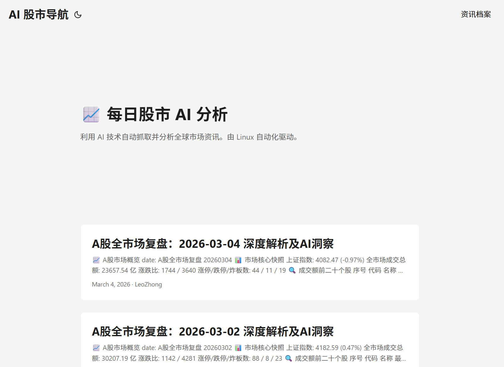
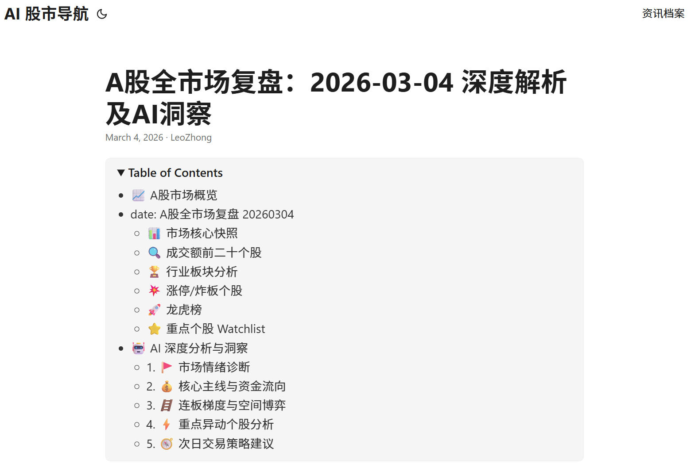
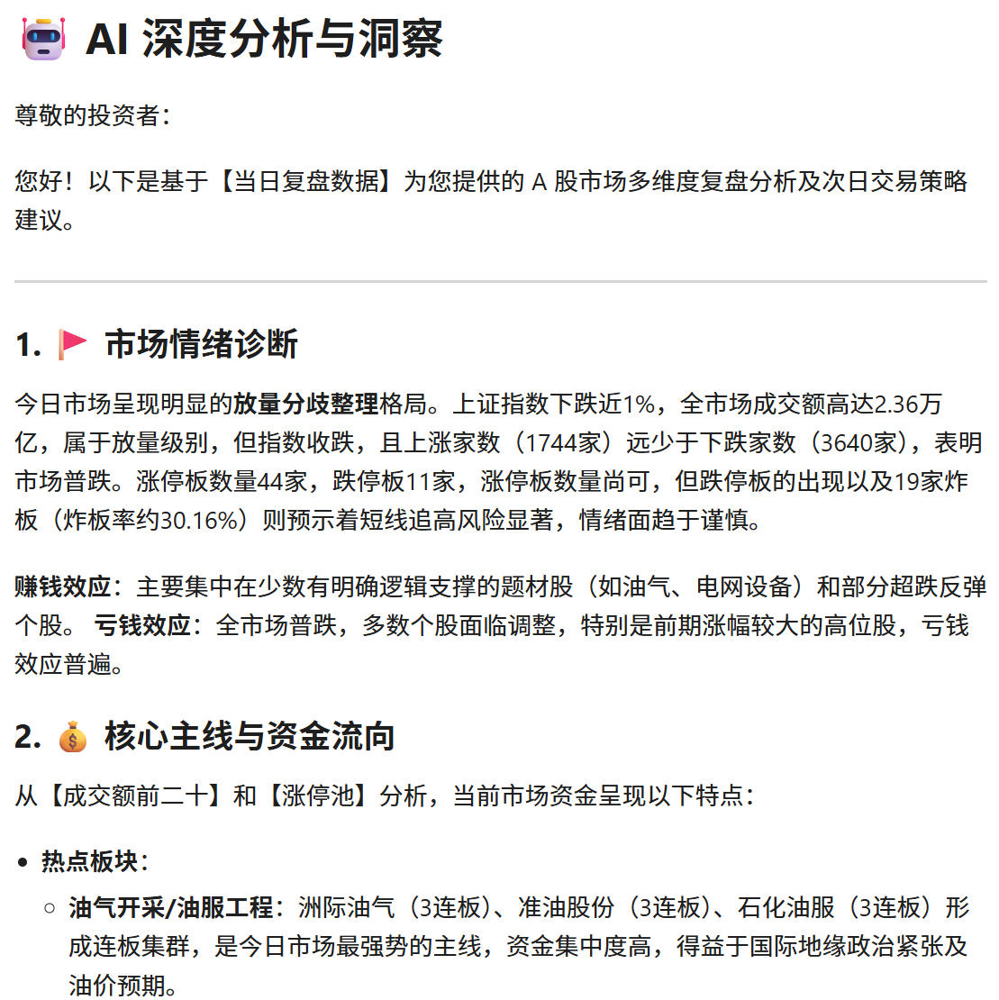

# 🚀 股票分析AI

🤖 **支持 OpenClaw** | 🇬🇧 [English](./README.md) | 🇨🇳 中文

👉 **[AI股票复盘博客](https://donvink.github.io/stock-review/)**

一个由 **Gemini AI** 驱动的自动化股票市场分析系统，原生支持 **OpenClaw**。本项目利用 Linux 自动化任务获取全球市场数据，生成深度的 A 股每日复盘报告，并自动同步至 **[Hugo博客](https://donvink.github.io/stock-review/)** 和 **微信公众号**。

## 环境要求

- 已安装 Node.js 环境
- 能够运行 `npx bun` 命令

## OpenClaw技能安装方法

**方式一：快速安装（推荐）**

```bash
npx skills add Donvink/stock-review
```

**方式二：通过 Agent 安装**

直接告诉 OpenClaw：

> 请从 github.com/Donvink/stock-review 安装技能

**方式三：从 ClawHub 安装**

```bash
clawhub install stock-review
```

### 🖥️ 首页概览
 

### 📂 报告目录


### 📈 AI分析示例
系统基于实时市场数据生成多维度分析报告。你可以在这里查看 2026 年 3 月 4 日的完整示例报告：

👉 **[查看示例AI报告：2026年3月4日](https://github.com/Donvink/stock-review/blob/main/data/20260304/ai_analysis_20260304.md)**

**报告核心洞察：**

* **市场情绪诊断**：基于涨跌家数比，对市场健康状况进行量化评估。
* **核心主线**：识别当日领涨的核心板块，如人工智能、数字经济和算力等。
* **价格行为分析**：跟踪关键个股的涨停表现和市场地位。
* **交易策略**：为下一个交易日提供具体的买卖点建议。




## 📸 项目概览

### 仪表盘预览

前端基于 **Hugo** 构建，提供了清晰直观的历史市场分析存档。


### 报告结构

每份报告都经过精心组织，涵盖市场快照、板块分析、涨停梯队和AI深度洞察。


---

## 📊 AI分析报告示例

系统基于 **AkShare** 的实时数据生成多维度分析报告：

* **市场情绪诊断**：量化分析涨跌比和涨停家数，判断当前市场所处的周期阶段。
* **核心主线与资金流向**：识别当日最强的领涨板块和主力资金的净流入方向。
* **涨停梯队与价格行为**：追踪市场最高连板股（空间板），分析市场风向标。
* **次日交易策略**：基于历史数据模型和AI逻辑，提供防守位和进攻位的参考建议。

---

## 🛠️ 部署与工作流

本程序针对 **WSL (Ubuntu)** 或 **Linux 服务器** 进行了优化，并完全支持通过 **GitHub Actions** 进行 CI/CD 自动化。

### 1. 克隆仓库

```bash
git clone https://github.com/your-username/stock-review.git
cd stock-review
```

### 2. 环境配置

确保已安装 Python 3.10+。安装所需依赖：

```bash
pip install -r requirements.txt
```

### 3. 配置（环境变量）

为了安全起见，切勿将密钥硬编码在代码中。请在本地使用 `.env` 文件，或在 GitHub 中配置 **Secrets**：

* `GEMINI_API_KEY`：你的 Google AI Studio API 密钥。
* `WECHAT_APP_ID`：你的微信公众号 AppID。
* `WECHAT_APP_SECRET`：你的微信公众号 AppSecret。

### 4. 执行

**手动生成并上传报告：**

```bash
cd skills/stock_review/scripts
python main.py
```

---

## 🤖 使用 GitHub Actions 自动化

本项目通过 GitHub Actions 实现了完全自动化，每日定时运行以获取收盘数据。

### 定时执行 (Cron)

工作流配置为在每个交易日的 **北京时间 21:00（UTC 13:00）** 自动触发。

```yaml
# .github/workflows/main.yml
on:
  schedule:
    # 13:00 UTC = 北京时间 21:00 (UTC+8)
    - cron: '0 13 * * 1-5' 
  workflow_dispatch: # 允许手动触发
```

### 自动化工作流步骤

1. **数据获取**：通过 AkShare 拉取最新的 A 股市场数据。
2. **AI 分析**：Gemini 2.5 Flash 生成 Markdown 格式的复盘文章。
3. **博客部署**：将 Markdown 文件提交至 Hugo 的内容目录，并重新部署站点至 [donvink.github.io/stock-review/](https://donvink.github.io/stock-review/)。
4. **微信集成**：将 Markdown 转换为带样式的 HTML，并上传至微信公众号的草稿箱。

---

### 💡 实用技巧

* **IP 白名单**：请记得在微信公众平台开发者设置中，将你的服务器 IP（或 GitHub Actions 运行器的 IP）添加到微信 API 白名单中。

---

### 💡 实现说明

* **时区偏差**：GitHub Actions 使用 UTC 时间。北京时间（CST）为 **UTC+8**。
* **Cron 语法解释**：`'0 13 * * 1-5'` 表示：
  * `0`：第 0 分钟
  * `13`：第 13 小时（UTC）
  * `* *`：每月的每一天
  * `1-5`：周一至周五（交易日）